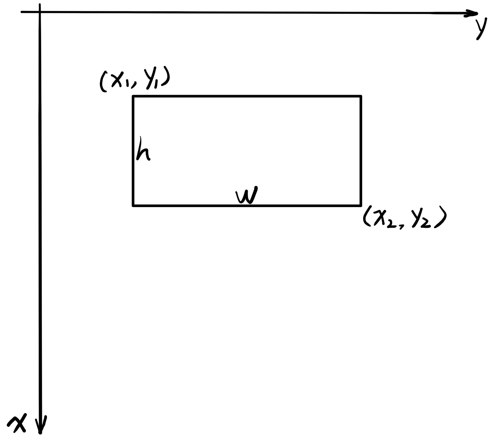

# Faster RCNN

## Device

It seems that running on CPU is ok for all the faster-rcnn process...

## Info

* Considering the behavior between training and testing, the operating process will be as follows:
1. The model designed in FasterRCNN file will has their own train() method as well as build_loss() method.  
2. The training function will be model specific, which means that you should call the training method via the model instance.

## Notes (What I have known about the faster RCNN)

* It is all computed using network, but not a continuous one. You have to train the RPN layer and the clasifier layer seperately.
* By applying the delta to the generated anchors, I used a different definition of matrix coordinates.  
	Due to the difficulties in defining height and width, I made a compromise that height means the difference between two x coordinates.  
	
* Roi pooling is being applied, but there is not backpragation operation required.

## Reference...

1. The illustration from [this](https://medium.com/@smallfishbigsea/faster-r-cnn-explained-864d4fb7e3f8) seems clear enough for me to start setting up the framework.  
	
2. The code is based on [this](https://github.com/longcw/faster_rcnn_pytorch)
3. The vgg16 architecture is as follows  
	
4. The NMS in the region proposal network is implemented based on [this](https://www.pyimagesearch.com/2015/02/16/faster-non-maximum-suppression-python/)  
